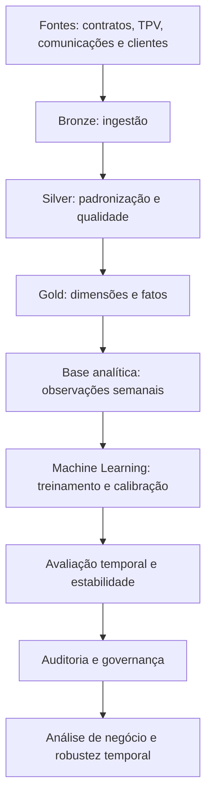

# Stone Data Challenge

**Engenharia de Dados, Analytics e Machine Learning aplicados à análise de contratos e pagamentos.**

Projeto de portfólio desenvolvido para demonstrar a construção de uma solução de dados de ponta a ponta, desde a ingestão de fontes heterogêneas até a avaliação de modelos preditivos, com atenção à qualidade, rastreabilidade e governança.

> **Status:** projeto analítico implementado e testado. Modelo preditivo classificado como **experimental**.

## 1. Contexto de negócio

O projeto investiga dados relacionados a contratos de crédito, pagamentos, transações financeiras (TPV) e ações de comunicação com clientes.

O desafio é organizar essas informações em uma estrutura analítica confiável e investigar padrões associados à ocorrência de pagamentos.

Entre as perguntas abordadas estão:

- Como integrar informações de contratos, clientes, transações e comunicações?
- Como garantir a consistência dos dados antes de utilizá-los em análises?
- Quais características estão associadas ao indicador de pagamento observado?
- Como avaliar um modelo respeitando a sequência temporal dos dados?
- Como identificar limitações que impedem o uso seguro de um modelo em produção?

## 2. Arquitetura da solução


```mermaid
flowchart TD
    A["Fontes: contratos, TPV, comunicações e clientes"]
    B["Bronze: ingestão"]
    C["Silver: padronização e qualidade"]
    D["Gold: dimensões e fatos"]
    E["Base analítica: observações semanais"]
    F["Machine Learning: treinamento e calibração"]
    G["Avaliação temporal e estabilidade"]
    H["Auditoria e governança"]
    I["Análise de negócio e robustez temporal"]

    A --> B --> C --> D --> E --> F --> G --> H --> I
```

A arquitetura utiliza Python, DuckDB e Parquet, com separação entre ingestão, tratamento, modelagem analítica e experimentação preditiva.

[Detalhes da arquitetura](docs/arquitetura.md)

## Evidências técnicas

| Indicador | Resultado |
|---|---:|
| Registros na camada Gold | 12.902.364 |
| Observações de Machine Learning | 801.725 |
| ROC AUC no teste | 0,7849 |
| Brier Score calibrado | 0,2025 |
| Testes automatizados locais | 126 aprovados |

**Modelo experimental:** as métricas se referem a um indicador-alvo cuja semântica financeira ainda necessita de validação. As probabilidades também apresentam superestimação no teste.

[Consultar evidências técnicas completas](docs/evidencias_tecnicas.md)

## 3. Tecnologias utilizadas

| Tecnologia | Aplicação |
|---|---|
| Python | Desenvolvimento de pipelines, análises e modelos |
| DuckDB | Processamento e consultas analíticas |
| Parquet | Armazenamento colunar |
| pandas e scikit-learn | Processamento analítico e Machine Learning |
| pytest | Testes automatizados |
| UV | Gerenciamento do ambiente Python |
| Git e GitHub | Versionamento |
| GitHub Actions | Integração contínua da demonstração sintética |

## 4. Engenharia de Dados

A solução organiza as fontes em camadas Bronze, Silver e Gold, com verificações de tipos, integridade, unicidade e reconciliação.

### Camada Gold

| Tabela | Registros |
|---|---:|
| Dimensão de clientes | 14.265 |
| Dimensão de contratos | 14.756 |
| Fato diário de contratos | 8.061.006 |
| Fato diário de TPV | 4.408.597 |
| Fato de comunicações | 403.740 |

Esses volumes correspondem aos artefatos analíticos utilizados no desenvolvimento local.

## 5. Machine Learning

Foi construída uma base de observações semanais de contratos para investigar a previsão de um indicador de pagamento em uma janela futura de sete dias.

A base contém **801.725 observações**, distribuídas entre 14.746 contratos.

A avaliação utilizou separação temporal, com intervalo de segurança entre os conjuntos.

| Conjunto | Observações |
|---|---:|
| Treinamento | 696.621 |
| Validação | 58.863 |
| Teste | 31.570 |

Foram avaliados modelos de referência e regressão logística, incluindo calibração de probabilidades.

### Resultados da regressão logística no teste

| Métrica | Resultado |
|---|---:|
| ROC AUC | 0,7849 |
| PR AUC | 0,7208 |
| Brier Score antes da calibração | 0,2527 |
| Brier Score após a calibração | 0,2025 |
| Taxa observada do indicador positivo | 44,82% |
| Probabilidade média prevista após calibração | 54,24% |

Embora a calibração tenha melhorado o Brier Score, a probabilidade média prevista permaneceu aproximadamente **9,42 pontos percentuais acima** da taxa observada.

Esse resultado indica uma limitação relevante de calibração no período de teste.

**Atenção à definição do alvo:** o indicador utilizado é uma aproximação construída a partir da presença de valores positivos em snapshots futuros. Não foi comprovado que ele represente exclusivamente novos pagamentos realizados na janela de sete dias.

Por esse motivo, os resultados não devem ser interpretados como uma previsão validada de recebimentos futuros.

## 6. Resultados da análise de negócio

A análise descritiva considerou **801.725 observações semanais** de **14.746 contratos**, entre **06/01/2020 e 11/04/2022**. A taxa geral do indicador `target_pagamento_7d` foi de **77,64%** (622.468 observações positivas). Como cada contrato pode aparecer em diversas semanas, as observações não são independentes.

### Características financeiras

| Segmento | Taxa do indicador positivo |
|---|---:|
| Valor desembolsado abaixo de R$ 2 mil | 61,07% |
| Valor desembolsado de R$ 2 mil a menos de R$ 5 mil | 67,14% |
| Valor desembolsado de R$ 5 mil a menos de R$ 10 mil | 71,99% |
| Valor desembolsado de R$ 10 mil ou mais | 80,00% |
| Prazo de até 12 meses | 67,32% |
| Prazo de 13 a 24 meses | 67,60% |
| Prazo de 25 a 36 meses | 79,11% |

### Frequência de campanhas

| Campanhas nos últimos 30 dias | Observações | Taxa do indicador positivo |
|---|---:|---:|
| Nenhuma | 502.912 | 86,74% |
| Uma | 122.670 | 64,70% |
| Duas a três | 109.402 | 68,11% |
| Quatro ou mais | 66.741 | 48,49% |

A associação entre maior frequência de campanhas e taxas menores do indicador **persistiu nas segmentações por valor e prazo**. Na análise de **dez trimestres**, as observações sem campanhas apresentaram taxas superiores às observações com campanhas em todos os períodos. A faixa de quatro ou mais campanhas teve a menor taxa em nove dos dez trimestres. As taxas também mudaram substancialmente ao longo do tempo.

**Interpretação:** a frequência de campanhas pode refletir a seleção de contratos com maior risco. Os resultados são **observacionais e não demonstram efeito causal** das campanhas sobre pagamentos.

### Informação preditiva incremental

Na mesma amostra de validação temporal (**58.863 observações**), a inclusão de características de comunicação elevou o **ROC AUC de 0,7745 para 0,8047** (+0,0302) e o **PR AUC de 0,7592 para 0,8156** (+0,0564), em comparação ao modelo com características financeiras apenas. O Brier Score também melhorou de 0,2134 para 0,2087. Esses ganhos dizem respeito à **validação**, não à avaliação final de teste, e não representam impacto financeiro ou causalidade.

O indicador-alvo ainda necessita de validação semântica como evento de **novo pagamento**. Assim, a pergunta de negócio foi respondida no escopo **descritivo e preditivo experimental**, não no escopo causal ou de decisão operacional.

[Conclusão de negócio detalhada](docs/conclusao_negocio.md)

## 7. Qualidade, auditoria e governança

Foram implementadas verificações adicionais para avaliar a consistência da solução:

- **Auditoria do indicador-alvo:** comparação entre a regra utilizada e uma aproximação alternativa baseada em variações positivas.
- **Auditoria temporal das features:** reconstrução de características a partir das datas de observação.
- **Análise de estabilidade:** acompanhamento do comportamento das previsões ao longo do tempo e entre segmentos.
- **Governança:** documentação das métricas, limitações e riscos identificados.

Na auditoria temporal, foram examinadas **97.188 observações** de validação e teste, sem divergências nas seis features reconstruídas.

Esse resultado não comprova, isoladamente, que todos os dados estivessem disponíveis operacionalmente nas respectivas datas.

**Classificação do modelo: EXPERIMENTAL.**

## 8. Testes automatizados

O projeto possui **126 testes aprovados no ambiente local**, cobrindo diferentes componentes da solução.

A suíte completa utiliza dados e artefatos previamente preparados e, portanto, não é executável integralmente a partir de uma instalação limpa sem essas dependências.

Para permitir uma validação independente, foi criada uma demonstração com dados totalmente sintéticos.

## 9. Demonstração reproduzível

A demonstração implementa um fluxo simplificado Bronze → Silver → Gold, sem depender dos dados originais.

Para executar:

```powershell
uv sync
uv run python -m stone_data_challenge.demo_pipeline --output data/demo --contracts 100 --seed 42
uv run pytest tests/test_demo_pipeline.py -v
```

A demonstração gera contratos, pagamentos e campanhas artificiais, aplica transformações e verifica integridade e reconciliação financeira.

**Validação realizada:** 12 testes aprovados localmente e execução bem-sucedida do workflow de integração contínua no GitHub Actions.

[Documentação da demonstração](docs/demo_reprodutivel.md)

## 10. Limitações

Este projeto é um estudo técnico e não uma solução de decisão de crédito pronta para produção.

As principais limitações identificadas incluem:

1. O indicador-alvo depende da interpretação dos valores presentes nos snapshots.
2. Existe desvio de calibração no período de teste.
3. A disponibilidade operacional histórica das informações não foi integralmente comprovada.
4. As associações entre campanhas e pagamentos não demonstram causalidade.
5. A demonstração sintética não reproduz a distribuição estatística dos dados originais.

Essas limitações são parte da análise técnica e orientam os próximos passos necessários antes de qualquer aplicação operacional.

## 11. Documentação

- [Arquitetura técnica](docs/arquitetura.md)
- [Estudo de caso](docs/estudo_de_caso.md)
- [Metodologia](docs/metodologia.md)
- [Resultados](docs/resultados.md)
- [Limitações](docs/limitacoes.md)
- [Demonstração reproduzível](docs/demo_reprodutivel.md)
- [Conclusão de negócio](docs/conclusao_negocio.md)


## 12. Considerações finais

O Stone Data Challenge demonstra a integração entre Engenharia de Dados, Analytics, Machine Learning e práticas de Engenharia de Software.

A análise de negócio encontrou associações recorrentes entre características contratuais, histórico de comunicação e o indicador construído, além de ganho preditivo incremental na validação temporal. Essas evidências não identificam efeitos causais.

O principal aprendizado é que desenvolver um modelo com métricas aparentemente satisfatórias não é suficiente. Também é necessário verificar a definição do problema, a confiabilidade dos dados, a consistência temporal e os riscos de utilização dos resultados.

**Projeto independente de portfólio. Não representa uma solução oficial da Stone nem uma implantação em produção.**