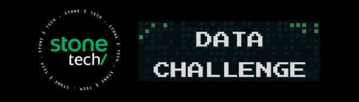

# STONE DATA CHALLENGE 
***Observação Importante:*** _Não participei deste Hackathon, apenas tive um grande interesse em estudar os dados e criar o Portfolio._

## *Descrição do Case*:
A Stone tem como objetivo ajudar o empreendedor brasileiro a vender, 
gerir e crescer seu negócio através dos nossos produtos e serviços que vão desde a maquininha de cartão de crédito à sistemas ERP para gestão.

Um dos produtos que oferecemos aos nossos clientes é o crédito, voltado para facilitar a vida do lojista e impulsionar o crescimento do seu negócio. 
A Stone trabalha desde 2019 para construir um produto sólido e maduro. Mesmo no momento mais intenso da pandemia provocada pela COVID-19, em 3 anos, 
já liberamos mais de 190 mil linhas de crédito, que somam mais de 3,4 bilhões de reais desembolsados para apoiar nossos clientes a crescer e manter seus negócios.

Nosso produto é diferenciado: os clientes pagam seus empréstimos através de um percentual de retenção aplicado sobre as transações realizadas pela 
maquininha de cartão Stone. Desta forma, conseguimos promover um pagamento sustentável do empréstimo que acompanha as variações de fluxo de caixa do lojista, 
que não precisa se comprometer com um valor fixo que possa pesar em um mês de baixo movimento em seu negócio. Um cliente pode ter mais de um contrato de empréstimo simultâneo, desde que o contrato anterior esteja em dia.

Durante a pandemia, naturalmente tivemos um aumento de clientes inadimplentes, ou seja, com problemas no pagamento de seus contratos e, consequentemente, 
sentimos a necessidade de evoluir nossas ações de comunicação e acionamento para recuperação dos saldos devedores que alguns 
clientes passaram a deixar em aberto.

Dentro desta evolução, uma das ações tomadas internamente foi refinar nossas estratégias de comunicação com os clientes, 
visando recuperar clientes que apresentavam problemas no ritmo de pagamento, e claro, sempre usando dados para melhor guiar nossas decisões!

Nesta edição do Stone Data Challenge, queremos dividir com você um dos problemas reais que nosso negócio enfrentou:

## Problema de Negócio

**“Qual é a curva ideal de vezes que devemos acionar um cliente?”**

Quando um cliente começa a apresentar dificuldade na liquidação de seus contratos, ele passa a ser elegível para ser acionado por nossa régua de comunicação com intuito de estimular a retomada do ritmo saudável de pagamento de acordo com o perfil e o momento de cada cliente.

As comunicações são disparadas por contrato, sendo assim, um cliente pode receber diversas comunicações com diferentes conteúdos, 
um para cada momento da jornada de seu respectivo contrato.

***Mais detalhes no Notebook***
